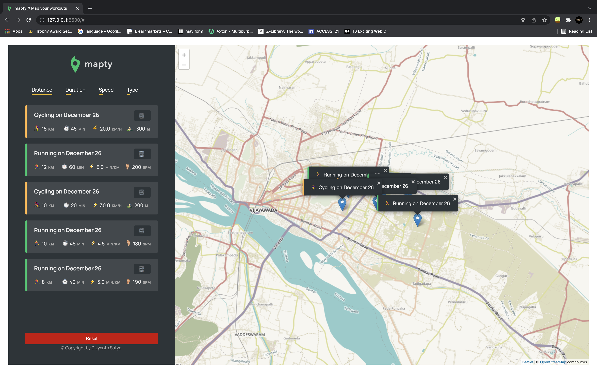

# Mapty

A small web app where you can log your running and cycling workouts, to check where you workout the most.

## Demo

You can view the application at this link https://divyanth2468.github.io/Mapty

## Features

- A map where user clicks to add new wokouts
- Uses Geolocation API to display user's current location
- Used the leaflet API to load the map
- Form to input distance, time, pace and steps/min (running) or elevation gain (cycling)
- Display all workouts in a list
- Display all workouts on the map with a marker
- Stores the input workout data in the local storage, so on page reload the data wont dissapear

## Screenshots

